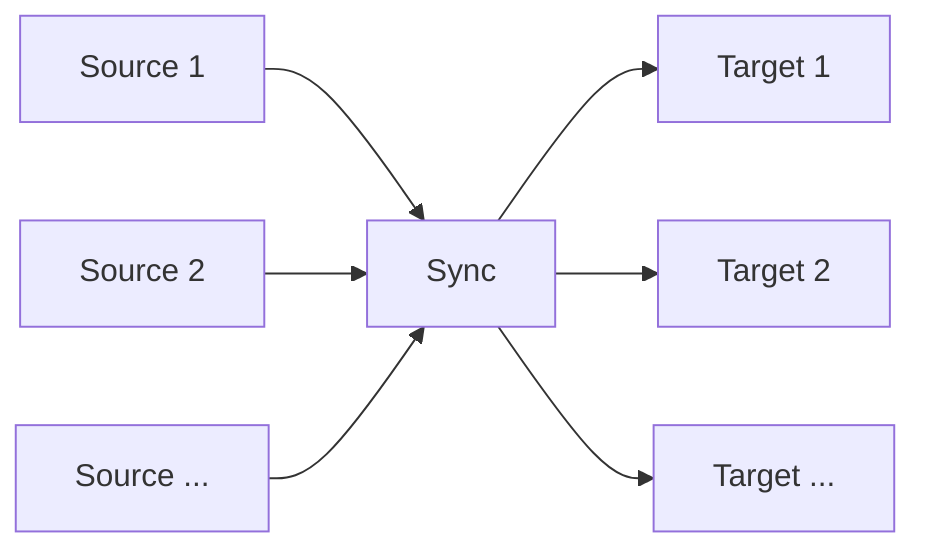
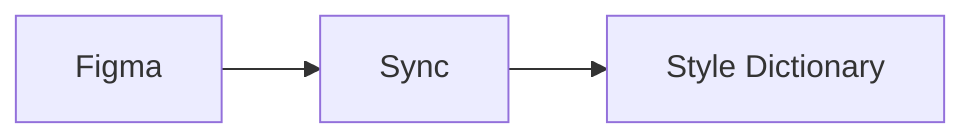
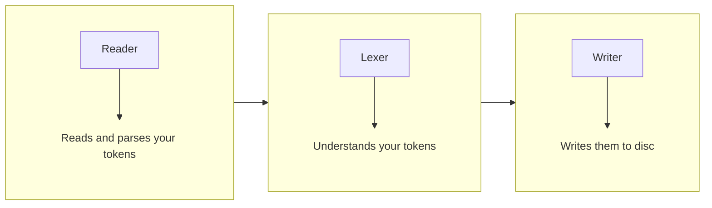

# Sync

Sync tokens from one tool to another, from multiple sources to multiple targets.



For example from your [design
tool](https://www.designtokens.org/glossary/#design-tool) to your [token
translation
tool](https://www.designtokens.org/glossary/#design-token-translation-tool):



## Architecture

This process is split into three steps:



- [Reader](./sync/reader.md) - Reads the tokens read from your source and parses
  them into a unified format
- [Lexer](./sync/lexer.md) - Understands the tokens your way
- [Writer](./sync/writer.md) - Writes them to disc according to your generated
  knowledge in the format of your preferred token translation tool

Theemo has support for a [Figma Reader](./sync/figma/reader.md) and [Style
Dictionary Writer](./sync/style-dictionary/writer.md) but thanks to its
pluggable architecture, you can [write your own
reader](./sync/reader.md#write-your-own-reader-plugin) or [write your own
writer](./sync/writer.md#write-your-own-writer-plugin) plugins.

## Setup

To get you started, install these packages:

```sh
pnpm add -D @theemo/cli @theemo/sync @theemo/figma @theemo/style-dictionary
```

Create a config file `theemo.config.mjs`, and start with this template. You'll
find further configuration in the respective readers and writers that you use.

```js
import { defineConfig } from '@theemo/cli';

export default defineConfig({
  sync: {...}
});
```

To run it, place it as a `script` in your `package.json`:

```json
{
  "scripts": {
    "sync": "theemo sync"
  }
}
```

Now you can run it with:

```sh
pnpm sync
```
