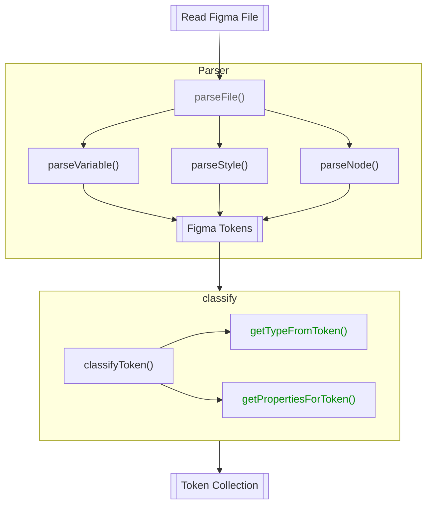
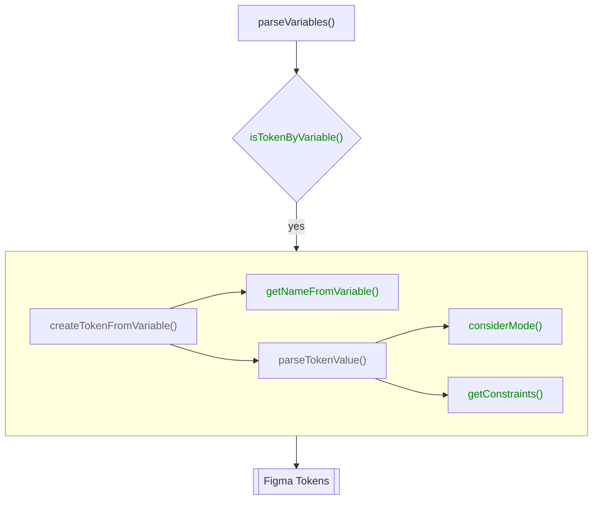
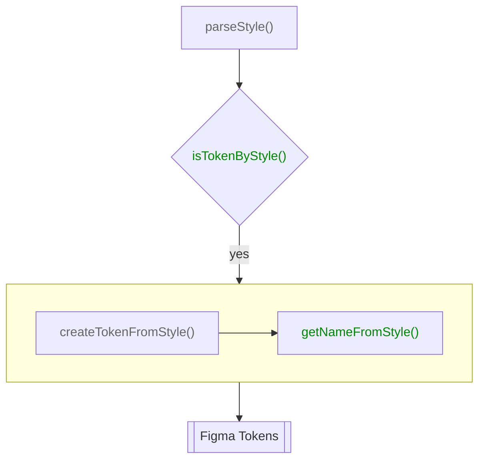
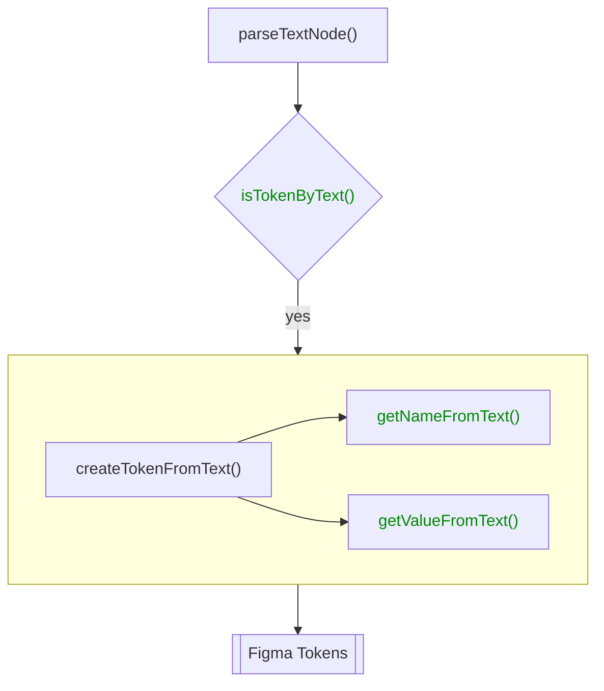

# Figma Reader

**Reads tokens from Figma** and parses them into a unified format.

To start use `figmaReader()` from `@theemo/figma`. Here is a basic config as template:

```js [theemo.config.js]
import { figmaReader } from '@theemo/figma';
import { defineConfig } from '@theemo/cli';

const { FIGMA_SECRET } = process.env;

export default defineConfig({
  sync: {
    reader: {
      sources: figmaReader({
        secret: FIGMA_SECRET,

        files: ['<your-figma-file-id>'],

        parser: {
          // ...
        }
      })
    }
  }
});
```

## Connecting to Figma

The `figmaReader()` is accessing your Figma file through their REST API, which
requires an API Key. Go to your Figma settings and generate a new Personal
Access Token.

### Usage in Development

To use it in development, put your secret into a `.env` file:

```sh
FIGMA_SECRET=
```

Theemo CLI will read from `.env` files.

### Usage in Production

For production, add it as secure environment variable in your CI provider.

### Enterprise Plan

For Figma users on an enterprise plan, you can request more information
from the REST API over users with a lower tier plan, such as variables.

::: warning
At the time of Writing, I never had the chance to access such an endpoint, so
support is not built-in.

Please refer to [Issue #691](https://github.com/theemo-tokens/theemo/issues/691)
:::

## Files

It is possible to collect tokens across multiple files. Add all the file IDs you
wish to sync from into the `files` array.

`figmaReader` will parse tokens from each file and then merge them together.

## Plugins

As much as Figma supports plugins, the same applies to `figmaReader()`. Theemo
in its basic usage does not rely on plugins. As Figma plugins are allowed to
expose data through the Figma Rest API, you can write plugins, that consume this
data to alter your tokens.

### Theemo Plugin

When using the [Theemo Plugin for Figma](../../design/figma.md) to export variables, you can use the Theemo plugin
for `figmaReader()` as its counterpart to consume those variables.

```js
import { figmaReader, theemoPlugin } from '@theemo/figma';
import { defineConfig } from '@theemo/cli';

export default defineConfig({
  sync: {
    reader: {
      sources: figmaReader({
        plugins: [
          theemoPlugin()
        ]
      })
    }
  }
});
```

Adding the plugin as shown above will make variables available in sync mode.

### Write Your own Plugin

Whether you are a Figma Plugin author and want to provide the sync counterpart
to your plugin or you are are in need to consume a third party Figma plugin, you
can [write your own plugin](./plugins.md).

## Parser

The heart of `figmaReader()` is the parser. The parser let's you read tokens from
[variables](#variables), [styles](#styles) and [text nodes](#text-nodes).

The flow for reading tokens from Figma is outlined here:



As per the flow graph above and in all others on this page. The green
functions is where you can intersect the default behavior and apply custom
logic.

That is all default behavior is exported (for those where it is available).
So you can safely write your customizations and defer to the default
implementation for all other situations. All examples in this page work follow
this idea and showcase the default behavior.

### Variables

Variables are the most atomic representation of design tokens in Figma. You
can read them with the [`theemo plugin`](#theemo-plugin) or [enterprise
plan](#enterprise-plan). Here is the flow, how variables are parsed:



Customizations options:

- [`isTokenByVariable()`](../../config/sync/figma-reader.md#parser-istokenbyvariable)
- [`getNameFromVariable()`](../../config/sync/figma-reader.md#parser-getnamefromvariable)
- [`considerMode()`](../../config/sync/figma-reader.md#parser-considermode)
- [`getConstraints()`](../../config/sync/figma-reader.md#parser-getconstraints)

::: info API Reference

- [`Variable` Type on Figma API](https://www.figma.com/developers/api#variables-types)

:::

### Styles

Styles are used for composite design tokens in Figma.
Theemo reads _every_ style through the Figma API, that exists in your files.



Customizations options:

- [`isTokenByStyle()`](../../config/sync/figma-reader.md#parser-istokenbystyle)
- [`getNameFromStyle()`](../../config/sync/figma-reader.md#parser-getnamefromstyle)

::: info API Reference

- [`Style` Type on Figma API](https://www.figma.com/developers/api#style-type)

:::

### Text Nodes

Theemo is not only able to extract tokens from styles, but also from text nodes
on the canvas itself.



::: warning
Theemo is older than Variables in Figma. Variables nowadays are a better fit and
if you already use them, all good. Keep reading to support legacy systems.
:::

Let's assume we use a [modular scale](https://www.modularscale.com/) system for
our sizing, we only need `base` and `ratio` parameters for this.

!#sizing[Sizing in Figma](./sizing.png)

[Figure 1](#figure-sizing) shows such a sizing configuration in Figma. Notice the `[token]` tags
as suffix for the node names. This will serve as indicators to recognize such
nodes as tokens in theemo.

Customizations options:

- [`isTokenByText()`](../../config/sync/figma-reader.md#parser-istokenbytext)
- [`getNameFromText()`](../../config/sync/figma-reader.md#parser-getnamefromtext)
- [`getValueFromText()`](../../config/sync/figma-reader.md#parser-getvaluefromtext)

::: info Reference

- [`Text` Node on Figma API](https://www.figma.com/developers/api#text-props)

:::

### Classify Tokens

Variables, Styles and Text Nodes will create an
internal `FigmaToken`. At the end of the process, `FigmaToken`s will be compiled
into `Token`s and the result of the reader is to return an array of `Token`s
which will be put into the [lexer](../lexer.md). In the last classification step,
you have the chance to do some cleanup or pass any data along with the token
that are relevant to your setup.

Customizations options:

- [`getTypeFromToken()`](../../config/sync/figma-reader.md#parser-gettypefromtoken)
- [`getPropertiesForToken()`](../../config/sync/figma-reader.md#parser-getpropertiesfortoken)
