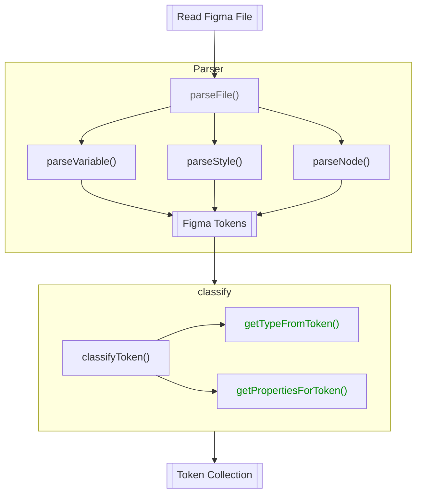
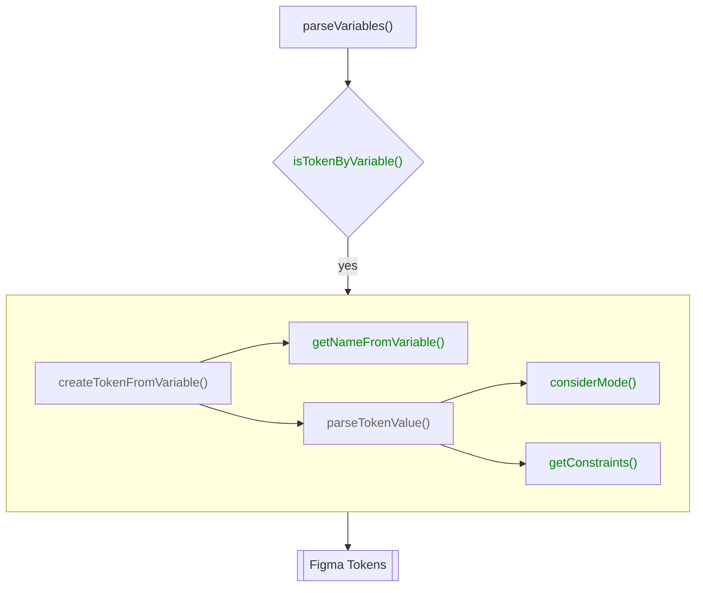
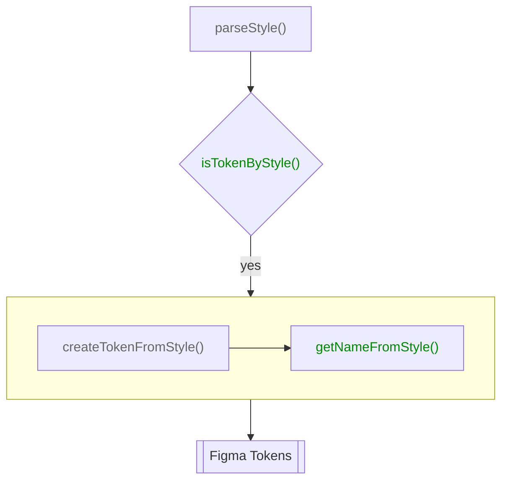
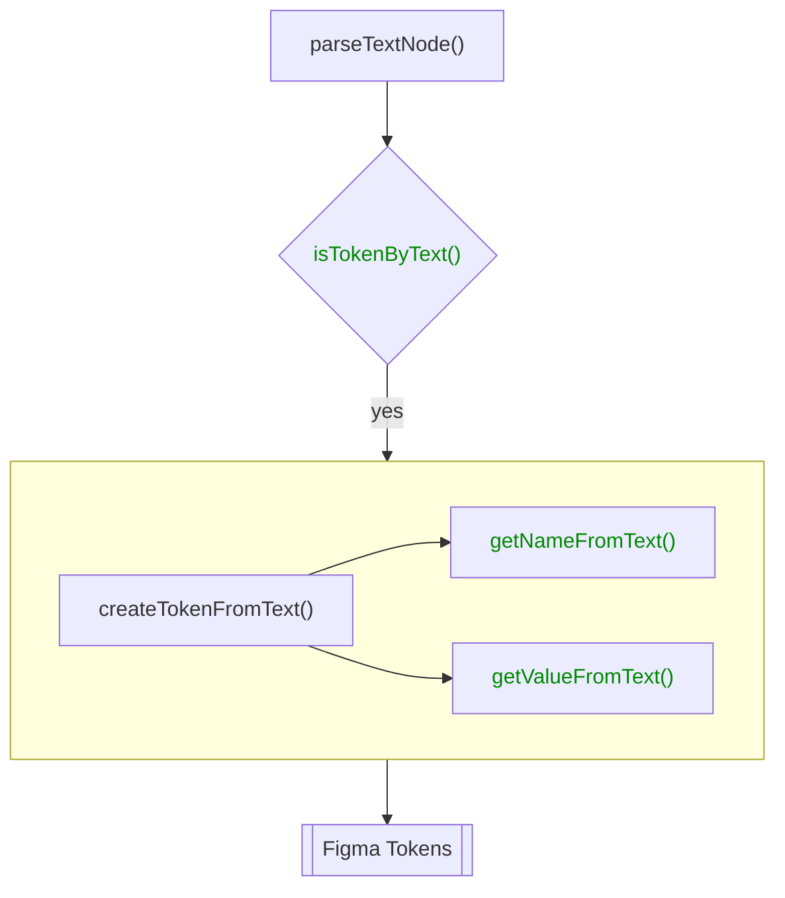

# Figma Reader

**Reads tokens from Figma** and parses them into a unified format.

To start use `figmaReader()` from `@theemo/figma`. Here is a basic config as template:

```js
import { figmaReader } from '@theemo/figma';
import { defineConfig } from '@theemo/cli';

const { FIGMA_SECRET } = process.env;

export default defineConfig({
  sync: {
    reader: {
      sources: figmaReader({
        secret: FIGMA_SECRET,

        files: ['<your-figma-file-id>'],

        parser: {
          // ...
        }
      })
    }
  }
});
```

## Connecting to Figma

The `figmaReader()` is accessing your Figma file through their REST API, which
requires an API Key. Go to your Figma settings and generate a new Personal
Access Token.

### Usage in Development

To use it in development, put your secret into a `.env` file:

```sh
FIGMA_SECRET=
```

Theemo CLI will read from `.env` files.

### Usage in Production

For production, add it as secure environment variable in your CI provider.

### Enterprise Plan

For Figma users on an enterprise plan, you can request more information
from the REST API over users with a lower tier plan, such as variables.

::: warning
At the time of Writing, I never had the chance to access such an endpoint, so
support is not built-in.

Please refer to [Issue #691](https://github.com/theemo-tokens/theemo/issues/691)
:::

## Files

It is possible to collect tokes across multiple files. Add all the file IDs you
wish to sync from into the `files` array.

`figmaReader` will parse tokens from each file and then merge them together.

## Plugins

As much as Figma supports plugins, the same applies to `figmaReader()`. Theemo
in its basic usage does not rely on plugins. As Figma plugins are allowed to
expose data through the Figma Rest API, you can write plugins, that consume this
data to alter your tokens.

### Theemo Plugin

When using the [Theemo Plugin for Figma](../../design/figma.md) to export variables, you can use the Theemo plugin
for `figmaReader()` as its counterpart to consume those variables.

```js
import { figmaReader, theemoPlugin } from '@theemo/figma';
import { defineConfig } from '@theemo/cli';

export default defineConfig({
  sync: {
    reader: {
      sources: figmaReader({
        plugins: [
          theemoPlugin()
        ]
      })
    }
  }
});
```

Adding the plugin as shown above will make variables available in sync mode.

### Write Your own Plugin

Whether you are a Figma Plugin author and want to provide the sync counterpart
to your plugin or you are are in need to consume a third party Figma plugin, you
can [write your own plugin](./plugins.md).

## Parser

The heart of `figmaReader()` is the parser. The parser let's you read tokens from
[variables](#variables), [styles](#styles) and [text nodes](#text-nodes).

The flow for reading tokens from Figma is outlined here:



### Customization

As per the flow graph above and in all examples on this page. The green
functions is where you can intersect the default behavior and apply custom
logic.

That is all default behavior is exported (for those where it is available).
So you can safely write your customizations and defer to the default
implementation for all other situations. All examples in this page work follow
this idea and showcase the default behavior.

### Variables

Variables are the most atomic representation of design tokens in Figma. You
can read them with the [`theemo plugin`](#theemo-plugin) or [enterprise
plan](#enterprise-plan). Here is the flow, how variables are parsed:



#### `isTokenByVariable()`

Tokens can be hidden from publishing within Figma. However, accessing through
the REST API is exposing _all_ variables. The default behavior mimics Figma's
behavior. You have the chance to add some additional logic, custom to your
system on checking which variables shall result in tokens or not.

```ts
import { figmaReader, isTokenByVariable } from '@theemo/figma';
import { defineConfig } from '@theemo/cli';

export default defineConfig({
  sync: {
    reader: {
      sources: figmaReader({
        // ...
        parser: {
          isTokenByVariable: (variable: FigmaVariable) => {
            // implement your custom logic here
            if (yourCustomLogic(variable)) {
              return false;
            }

            // ...or else use default behavior
            return isTokenByVariable(variable);
          };
        }
      })
    }
  }
});
```

::: info Default Behavior

Filters out variables hidden from publishing and boolean type variables.

[Reference](https://github.com/theemo-tokens/theemo/blob/8416df80bc0d0f801777cfdece259a660f7c4cff/packages/%40theemo/figma/src/config.ts#L153)

TODO link to API
:::

#### `getNameFromVariable()`

Even though Figma shows hierarchy for your styles and variables, internally
those are separated with a `/` character, hence Figma disallows the usage of `.`
as part of the variable name, to align with [DTCG
Format](https://tr.designtokens.org/format/#character-restrictions)  as the `.`
is used as group separator. The default implementation takes care of this
transformation. You may use this functions to apply name transformations,
according to your [token specification](../../design-tokens/token-specification.md).

```ts
import { figmaReader, getNameFromVariable } from '@theemo/figma';
import { defineConfig } from '@theemo/cli';

export default defineConfig({
  sync: {
    reader: {
      sources: figmaReader({
        // ...
        parser: {
          getNameFromVariable: (variable: FigmaVariable) => {
            // implement your custom logic here
            if (variable.name.includes('primary')) {
              return variable.name.replace('primary', 'ARE-YOU-SURE-WHAT-THAT-MEANS?');
            }

            // ... or else use default behavior
            return getNameFromVariable(variable);
          };
        }
      })
    }
  }
});
```

::: info Default Behavior

Replaces `/` with `.` and lower cases all names.

[Reference](https://github.com/theemo-tokens/theemo/blob/8416df80bc0d0f801777cfdece259a660f7c4cff/packages/%40theemo/figma/src/config.ts#L157)
:::

#### `considerMode()`

Variables support different modes. Some are relevant for your design system,
others you can completely ignore for synching tokens. As theemo cannot predict
which ones you want to consider for exporting tokens, you can declare such.

::: info
It only applies to collections with more then _one_ mode.
:::

For considering your `light` and `dark` modes, here is how:

```ts
import { figmaReader } from '@theemo/figma';
import { defineConfig } from '@theemo/cli';

export default defineConfig({
  sync: {
    reader: {
      sources: figmaReader({
        parser: {
          considerMode: (mode: string) => {
            return ['light', 'dark'].includes(mode);
          },
        }
      })
    }
  }
});
```

#### `getConstraints()`

As your modes can take arbitrary names, such as:

- `light`, `dark`
- `light-more`, `light-less`, `dark-more`, `dark-less`
- `sunrise`, `day`, `sunset`, `night`

For theemo it is impossible to guess the appropriate constraints. As such, you
need to provide and explain the behavior of your system. The example above
for [`considerMode()`](#considermode), qualifies `light` and `dark` as
appropriate modes, let's continue assigning their constraints:

```ts
import { figmaReader } from '@theemo/figma';
import { defineConfig } from '@theemo/cli';

export default defineConfig({
  sync: {
    reader: {
      sources: figmaReader({
        parser: {
          getConstraints(mode: string/*, variable: FigmaVariable*/) {
            if (mode === 'light' || mode === 'dark') {
              return { features: { 'color-scheme': mode } };
            }
          }
        }
      })
    }
  }
});
```

::: info Constraints

Theemo has a very advanced and flexible system to describe constraints. Read
more on [features for themes](../../design-tokens/theming.md#features).

TODO: Links to `Constraint` types
:::

### Styles

Styles are used for composite design tokens in Figma.
Theemo reads _every_ style through the Figma API, that exists in your files.



::: info API Reference

- [`Style` Type on Figma API](https://www.figma.com/developers/api#style-type)

:::

#### `isTokenByStyle()`

Each style found in the Figma file is passed into that function and being asked,
whether this is a token or not.

The default implementation is, if the name of the token starts with a `.`, it
will respond `false`. That is the default behavior of Figma, where you can't
publish styles that begin with a `.` (as it is like a hidden folder on a unix
system).

You can use this function to apply your own behavior. Here in this case, styles
are ignored, when they contain braces:

```ts
import { figmaReader, isTokenByStyle } from '@theemo/figma';
import { defineConfig } from '@theemo/cli';
import type { Style } from 'figma-api';

export default defineConfig({
  sync: {
    reader: {
      sources: figmaReader({
        parser: {
          isTokenByStyle: (style: Style) => {
            return !style.name.includes('(') && !style.name.includes(')') && isTokenByStyle(style);
          }
        }
      })
    }
  }
});
```

::: info
TODO link to API
:::

#### `getNameFromStyle()`

To actually get the name of a style. By default, it will pass through the
name of the token as in Figma, replacing `/` with `.`.

For customizations, such as prefixing text styles with `typography/`, see here:

```ts
import { figmaReader, getNameFromStyle } from '@theemo/figma';
import { defineConfig } from '@theemo/cli';
import type { Style } from 'figma-api';

export default defineConfig({
  sync: {
    reader: {
      sources: figmaReader({
        parser: {
          getNameFromStyle(style: Style) {
            if (style.styleType === 'TEXT') {
              return getNameFromStyle({
                ...style,
                name: `typography/${style.name}`
              });
            }

            return getNameFromStyle(style);
          },
        }
      })
    }
  }
});
```

::: info
TODO link to API
:::

### Text Nodes

Theemo is not only able to extract tokens from styles, but also from text nodes
on the canvas itself.



::: warning
Theemo is older than Variables in Figma. Variables nowadays are a better fit and
if you already use them, all good. Keep reading to support legacy systems.
:::

Let's assume we use a [modular scale](https://www.modularscale.com/) system for
our sizing, we only need `base` and `ratio` parameters for this.

!#sizing[Sizing in Figma](./sizing.png)

[Figure 1](#figure-sizing) shows such a sizing configuration in Figma. Notice the `[token]` tags
as suffix for the node names. This will serve as indicators to recognize such
nodes as tokens in theemo.

::: info API Reference

- [`Text` Node on Figma API](https://www.figma.com/developers/api#text-props)

:::

#### `isTokenByText()`

By default no tokens are recognized, so we need to teach theemo to understand
text nodes who include the `[token]` tag:

```ts
import { figmaReader } from '@theemo/figma';
import { defineConfig } from '@theemo/cli';
import type { Node } from 'figma-api';

export default defineConfig({
  sync: {
    reader: {
      sources: figmaReader({
        // ...
        parser: {
          isTokenByText(node: Node<'TEXT'>) {
            return node.name.includes('[token]');
          }
        }
      })
    }
  }
});
```

::: info
TODO - link to API
:::

#### `getNameFromText()`

Next up is to actually get the name from the node we let pass earlier. Here we
drop the `[token]` tag to get the _clean_ token name:

```ts
import { figmaReader } from '@theemo/figma';
import { defineConfig } from '@theemo/cli';
import type { Node } from 'figma-api';

export default defineConfig({
  sync: {
    reader: {
      sources: figmaReader({
        // ...
        parser: {
          getNameFromText(node: Node<'TEXT'>) {
            return node.name.replace('[token]', '').trim();
          }
        }
      })
    }
  }
});
```

::: info
TODO - link the default implementation
:::

#### `getValueFromText()`

So far theemo is handling a `node` which it knows it is a token and what the
name is. Finally we need to get the actual _value_ from the node. Theemo
provides a default implementation by returning the `characters` property from
the `node` (= the contents), which should already do it. However, you are free
to overwrite this behavior at this point.

::: info
TODO - link the default implementation
:::

### Classify Tokens

Variables, Styles and Text Nodes will create an
internal `FigmaToken`. At the end of the process, `FigmaToken`s will be compiled
into `Token`s and the result of the reader is to return an array of `Token`s
which will be put into the [lexer](../lexer.md). In the last classification step,
you have the chance to do some cleanup or pass any data along with the token
that are relevant to your setup.

::: info API References

TODO API links

:::

#### `getTypeFromToken()`

While handling the tokens from reading and parsing the source, theemo tries to
detect the _type_ of a token, based on the related Figma construct (ie. `Node`
or `Style`). You can provide your own customization to this:

```ts
import { figmaReader } from '@theemo/figma';
import { defineConfig } from '@theemo/cli';

export default defineConfig({
  sync: {
    reader: {
      sources: figmaReader({
        // ...
        parser: {
          getTypeFromToken: (token: FigmaToken) => {
            if (token.style) {
              return getTypefromStyle(token.style);
            }

            return '';
          };
        }
      })
    }
  }
});
```

::: info
TODO link to API
:::

#### `getPropertiesForToken()`

You might find yourself in the need to add additional properties to the token
that is parsed from Figma. For example, you might want to include the Figma name
of the related style to be able to show them both on the generated token
documentation. Here is how:

```ts
import { figmaReader } from '@theemo/figma';
import { defineConfig } from '@theemo/cli';

export default defineConfig({
  sync: {
    reader: {
      sources: figmaReader({
        // ...
        parser: {
          getPropertiesForToken: (token: FigmaToken/*, document?: FigmaDocument*/) => {
            if (token.figmaName) {
              return {
                figmaName: token.figmaName
              };
            }
          };
        }
      })
    }
  }
});
```

You'll also receive the Figma `document` as second parameter. With that you can
perform your own lookups with the Figma document. Please refer to their
[REST API documention](https://www.figma.com/developers/api#get-files-endpoint).

::: info
TODO link to API
:::

<!--
### Output

Here are some samples from how the tokens are looking after they are read and
parsed from Figma:

```js
[
  // pair of contextual tokens
  {
    name: 'layout.background.$light',
    description: '',
    tier: 'unknown',
    type: 'color',
    colorScheme: undefined,
    reference: undefined,
    value: '#FFFFFF'
  },
  {
    name: 'layout.background.$dark',
    description: '',
    tier: 'unknown',
    type: 'color',
    colorScheme: undefined,
    reference: undefined,
    value: '#4D4D4D'
  },
  {
    name: 'layout.background',
    description: '',
    tier: 'unknown',
    type: 'color',
    colorScheme: undefined,
    reference: undefined,
    value: '#FFFFFF'
  },
  // regular token
  {
    name: 'intent.action.base.text',
    description: '',
    tier: 'unknown',
    type: 'color',
    colorScheme: undefined,
    reference: undefined,
    value: '#FFEC40'
  },
  // token with a reference
  {
    name: 'intent.action.active.text',
    description: '',
    tier: 'unknown',
    type: 'color',
    colorScheme: undefined,
    reference: 'intent.action.base.text',
    value: '#FFEC40'
  },
  // token with a reference and transform
  {
    name: 'intent.action.disabled.text',
    description: '',
    tier: 'unknown',
    type: 'color',
    colorScheme: undefined,
    reference: 'intent.action.base.text',
    value: 'rgba(255, 236, 64, 0.65)',
    transforms: { opacity: -35 }
  },
  // specific token
  {
    name: 'hero.text',
    description: '',
    tier: 'unknown',
    type: 'color',
    colorScheme: undefined,
    reference: 'text.normal',
    value: '#000000'
  },
  // text token
  {
    name: 'sizing.ratio',
    description: undefined,
    tier: 'unknown',
    type: 'content',
    colorScheme: undefined,
    reference: undefined,
    value: '1.3'
  }
  //...
];
```

-->

<!-- 
## References

- [ReaderConfig](/api/theemo.readerconfig)
- [FigmaReaderConfig](/api/theemo.figmareaderconfig) -->
