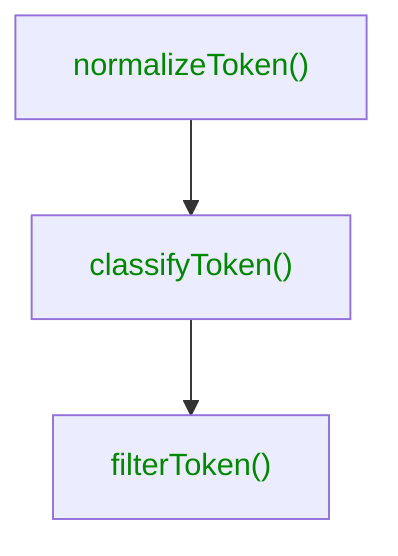

# Lexer

This step runs a lexical analysis based on your input to make tokens
understandable _to you_. The lexer will receive a `TokenCollection` from the
[reader](./reader.md) modifies the set of tokens and returns a `TokenCollection`
that will be the input to the [writer](./writer.md).

For the modification, the lexer applies these steps, that act upon your
configuration.

The output of one step is the input to the next step. If you classify a token,
you can use these information to filter them afterwards.

See your configuration options in detail with samples:

- [`normalizeToken()`](../config/sync.md#synclexernormalizetoken)
- [`classifyToken()`](../config/sync.md#synclexerclassifytoken)
- [`filterToken()`](../config/sync.md#synclexerfiltertoken)
