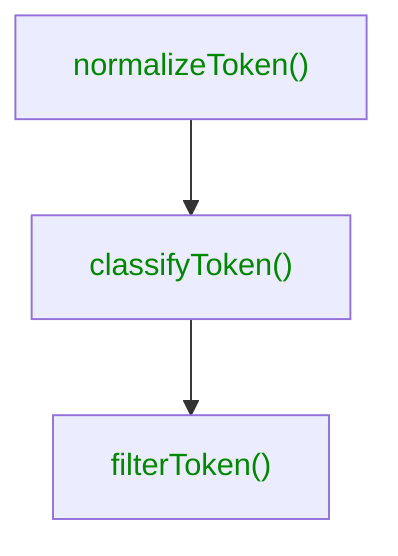

# Lexer

This step runs a lexical analysis based on your input to make tokens
understandable. The lexer will receive a `TokenCollection` from the
[reader](./reader.md) modifies the set of tokens and returns a `TokenCollection`
that will be the input to the [writer](./writer.md).

For the modification, the lexer applies these steps, that act upon your
configuration.



The output of one step is the input to the next step. If you classify a token,
you can use these information to filter them afterwards.

## `normalizeToken()`

The purpose of normalization is to "tidy" up your token (names), such as
cleaning up possible whitespace or when you are using contexts to extract
that part into a structured property.

```ts
import { defineConfig } from '@theemo/cli';

import type { Token } from '@theemo/tokens';

export default defineConfig({
  sync: {
    lexer: {
      normalizeToken(token: Token) {
        return {
          ...token,
          name: token.name.trim()
        };
      }
    }
  }
});
```

## `classifyToken()`

Classifying tokens is to give them a meaning. Here you'll want to set
[token internals](../design-tokens/internals.md). What's the token tier or its visibility?

Here is a way to set visibility:

```ts
import { defineConfig } from '@theemo/cli';

import type { Token } from '@theemo/tokens';

export default defineConfig({
  sync: {
    lexer: {
      classifyToken(token: Token) {
        // assuming you have set `figmaName` before
        return {
          ...token,
          visibility: token.figmaName.startsWith('.') ? 'internal' : 'public'
        }
      }
    }
  }
});
```

## `filterToken()`

Finally, with structured information available on tokens, it's time to finally
filter the output from Figma to our needs.

For example, you are not interested in `internal` tokens - but all others, this
is what your filter can look like:

```ts
import { defineConfig } from '@theemo/cli';

import type { Token } from '@theemo/tokens';

export default defineConfig({
  sync: {
    lexer: {
      filterToken(token: Token) {
        return token.visibility !== 'internal';
      }
    }
  }
});
```
