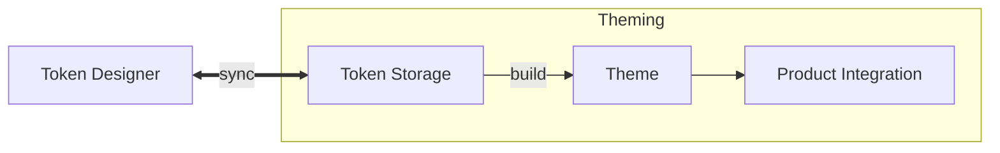

# Theming

Theming includes the act of building a theme from your tokens (after
[sync](./sync.md)) and integrate this theme in your product rsp. managing themes
at runtime.

Theemo supports you doing that for the web platform.

## Building

Building a theme is a two part process.

1. [Convert your tokens into assets for your platform (CSS) using Style
   Dictionary](./theming/build/style-dictionary.md)
2. [Bundle up a package for integration with your product](./theming/build/theme-package.md)

## Integration

Integration in your product requires loading theme(s) and manage them at runtime
to switch between them or turn [features](./design-tokens/features.md) on or off.

:arrow_right: [Integrate Themes in your Product](./theming/integrations.md)
