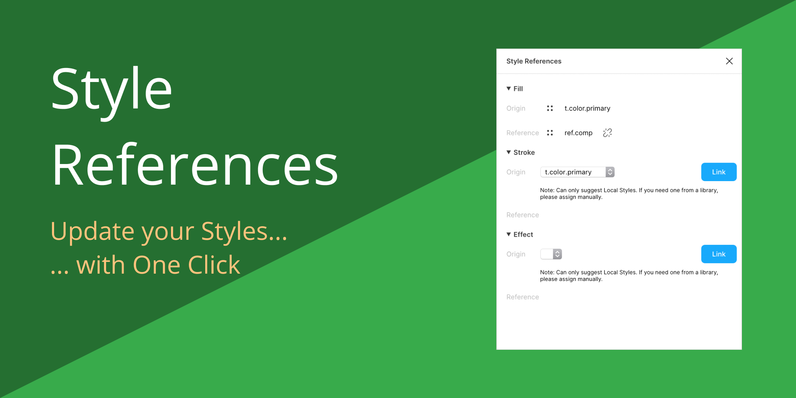

# Figma Plugin: Style References

Figma plugin to reference styles. It's main purpose is to allow you to have an
origin style mapped to a reference style, which will kept in sync with the
origin style.

This plugin will let you do this:

1. Manage style references on a selected node
2. Auto-update all references as you change origins (keep the plugin open for this)
3. Export references to make it available for third-party consumers
4. Switch contexts

## Manual

### 1. Manage References

Select a node for which you want to manage references, eg. a rectangle. Open the
"Style References" plugin and a dialog will appear that let you do it. Currently
these styles are supported:

- Fill Style
- Stroke Style
- Effect Style

For each of those there is a section in the dialog where you can manage the
origin style to the reference.

- **Origin** That's the _original_ style.
- **Reference** That's the style to which the origin is copied over when
  references are updated.

### 2. Export

You can export your references to [jsonbin.io](https://jsonbin.io) and by that
make it available for third-party consumers, e.g. if you want to update your
design tokens in your code. Here is how:

Enter credentials in settngs:

1. Create an account and copy the API Key
2. Create a bin and copy the bin URL

On the tools tab the `Export Settings` button becomes available. Clicking the
button will export your references.

### 3. Contexts

Contexts are a lightweight way to organize various theme modes within one
document. E.g. if you have light and dark mode in one document, you may want to
give styles for respective styles a specific suffix, e.g. `.$dark` - With
defined contexts, you can swap between them quickly and then use
[Themer](https://www.figma.com/c/plugin/731176732337510831/Themer) to export
them.

#### Workflow Suggestion

Use it in combination with Themer:

1. Set your variants for each context (`§light` and `§dark`)
2. Select a context
3. Use `Style References` to map those "compiled" styles
4. Use `Themer` to export and apply them

### Things to Know

- When setting the origin style the suggestions only show local styles, that is
  also due to limitations of the current figma API, given security reasons for
  shared team libraries. That's fair - figma keeps us safe, give them credit for
  that :)

  It still is possible to use library styles, then you can't use the style
  references manage dialog, instead manually assign those style and THEN use the
  style references dialog in order to persist it.

- Once you have one node "under management", you may want to change the local
  style but once you update references, those new ones will be overridden. Re-select
  the node again and the references dialog will provide you options for migrating
  styles, to either keep the old one or use the new one.

- Once you link origin to reference the node itself will show the reference as
  its local style, which might give you wonders, yet is expected and the correct behavior.

## Development

To develop this on your own. Install depencencies first:

```bash
$ yarn
```

Second, start the watch server:

```bash
$ yarn start
```
