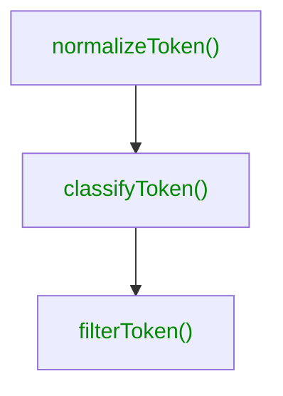

This step runs a lexical analysis based on your input to make tokens
understandable. The lexer will return a **token collection** that will be the
input to the writer.



The output of one step is the input to the next step. If you classify a token,
you can use these information to filter them afterwards.

## Input

The output from the [reader](./reader) is the input to the lexer, so here some
sample data for which to apply the above mentioned customizations on:

```js
[
  // pair of contextual tokens
  {
    name: 'layout.background.$light',
    description: '',
    tier: 'unknown',
    type: 'color',
    colorScheme: undefined,
    reference: undefined,
    value: '#FFFFFF'
  },
  {
    name: 'layout.background.$dark',
    description: '',
    tier: 'unknown',
    type: 'color',
    colorScheme: undefined,
    reference: undefined,
    value: '#4D4D4D'
  },
  {
    name: 'layout.background',
    description: '',
    tier: 'unknown',
    type: 'color',
    colorScheme: undefined,
    reference: undefined,
    value: '#FFFFFF'
  },
  // regular token
  {
    name: 'intent.action.base.text',
    description: '',
    tier: 'unknown',
    type: 'color',
    colorScheme: undefined,
    reference: undefined,
    value: '#FFEC40'
  },
  // token with a reference
  {
    name: 'intent.action.active.text',
    description: '',
    tier: 'unknown',
    type: 'color',
    colorScheme: undefined,
    reference: 'intent.action.base.text',
    value: '#FFEC40'
  },
  // token with a reference and transform
  {
    name: 'intent.action.disabled.text',
    description: '',
    tier: 'unknown',
    type: 'color',
    colorScheme: undefined,
    reference: 'intent.action.base.text',
    value: 'rgba(255, 236, 64, 0.65)',
    transforms: { opacity: -35 }
  },
  // specific token
  {
    name: 'hero.text',
    description: '',
    tier: 'unknown',
    type: 'color',
    colorScheme: undefined,
    reference: 'text.normal',
    value: '#000000'
  },
  // text token
  {
    name: 'sizing.ratio',
    description: undefined,
    tier: 'unknown',
    type: 'content',
    colorScheme: undefined,
    reference: undefined,
    value: '1.3'
  }
  //...
];
```

## `normalizeToken()`

The purpose of normalization is to "tidy" up your token (names), such as
cleaning up possible whitespace or when you are using contexts to extract
that part into a structured property.

The normalization step has a _default behavior_, which should serve
as a minimal configuration out of the box:

```js
{
  lexer: {
    // /**
    //  * Default normalization strips white space from your token and reference name
    //  */
    // normalizeToken(token: Token): Token {
    //   const normalized = { ...token };
    //   normalized.name = normalized.name.replace(/\s/g, '');
    //   if (normalized.reference) {
    //     normalized.reference = normalized.reference.replace(/\s/g, '');
    //   }
    //   return normalized;
    // },
  }
}
```

There is no need to overwrite the `normalizeToken()`, if that default behavior
suits you.

For our set of tokens, we are customizing the behavior to account for
contextual tokens, whose name ends in `.$light` or `.$dark`, by moving
that part to the `colorScheme` property.

```js
function normalizeName(name) {
  // lowercase all things
  let n = name.toLowerCase();

  // remove all clutter
  n = n.replace(/\s+/, '');

  // from folders to canonical name (if we haven't already)
  n = n.replace(/\//g, '.');

  // hand it back ;)
  return n;
}

module.exports = {
  sync: {
    lexer: {
      normalizeToken(token) {
        const normalized = { ...token };

        // normalize names
        normalized.name = normalizeName(normalized.name);
        if (normalized.reference) {
          normalized.reference = normalizeName(normalized.reference);
        }

        // normalize contexts
        const tokenContextIndex = normalized.name.indexOf('.$');
        if (tokenContextIndex !== -1) {
          normalized.colorScheme = normalized.name.slice(tokenContextIndex + 2);
          normalized.name = normalized.name.slice(0, tokenContextIndex);
        }

        return normalized;
      }
    }
  }
};
```

That will turn the layout tokens from above ...

```js
[
  // pair of contextual tokens
  {
    name: 'layout.background.$light',
    description: '',
    tier: 'unknown',
    type: 'color',
    colorScheme: undefined,
    reference: undefined,
    value: '#FFFFFF'
  },
  {
    name: 'layout.background.$dark',
    description: '',
    tier: 'unknown',
    type: 'color',
    colorScheme: undefined,
    reference: undefined,
    value: '#4D4D4D'
  }
  //...
];
```

... into ...

```js
[
  // pair of contextual tokens
  {
    name: 'layout.background',
    description: '',
    tier: 'unknown',
    type: 'color',
    colorScheme: 'light',
    reference: undefined,
    value: '#FFFFFF'
  },
  {
    name: 'layout.background',
    description: '',
    tier: 'unknown',
    type: 'color',
    colorScheme: 'dark',
    reference: undefined,
    value: '#4D4D4D'
  }
  //...
];
```

## `classifyToken()`

Classifying tokens is to give them a meaning. What's the token tier? What's the
color scheme (if not already), what's the color contrast and so forth.

We also have access to `raw` and `normalized` sets of tokens in order to perform
lookup checks.

```js
function isTransient(token, tokens) {
  const hasColorSchemes = tokens.some(
    (t) => t.colorScheme && t.name === token.name
  );
  const isReference = !token.colorScheme && hasColorSchemes;

  return token.type !== 'basic' && isReference;
}

module.exports = {
  sync: {
    lexer: {
      // ..

      classifyToken(token, tokens) {
        const t = { ...token };
        t.tier = token.name.startsWith('.')
          ? 'basic'
          : token.name.startsWith('hero')
          ? 'specific'
          : 'purpose';
        t.transient = isTransient(t, tokens.normalized);

        return t;
      }
    }
  }
};
```

Tokens starting with a `.` are considered `basic` tier (and within Figma,
they are not publishable). `Specific` (or component) token tiers are only
available for the `hero.*` tokens, all others are `purpose` token tiers.

Reading tokens from Figma will also include tokens
such as `layout.background` directly (without the `.$light` or `.$dark` suffix).
They are classified as _transient_ to indicate these are consumer tokens, but the
actual value is replaced with the token from a given context (light or dark in
this case). Having this information stored at the token will help for
[building](../build.md) and therefore [generating](../generate.md) tokens.

## `filterToken()`

Finally, with structured information available on tokens, it's time to finally
filter the output from Figma to our needs. Given you are not interested in
`basic` tier tokens - but all others, this is what your filter can look like:

```js
module.exports = {
  sync: {
    lexer: {
      // ..

      filterToken(token) {
        return token.tier !== 'basic';
      }
    }
  }
};
```

:::info
That is if you classify the tokens differently than explained in this article.
Following the exact article here, this might not be needed as tokens starting
with a `.` will already be excluded by the [reader](./reader.md).
:::

## Output

Through the lexical analysis the tokens contain more information in a structured
way. This is great as it will help to [write](./writer.md) tokens to disk.

```js
[
  // pair of contextual tokens
  {
    name: 'layout.background',
    description: '',
    tier: 'purpose',
    type: 'color',
    colorScheme: 'light',
    reference: undefined,
    value: '#FFFFFF',
    transient: false
  },
  {
    name: 'layout.background',
    description: '',
    tier: 'purpose',
    type: 'color',
    colorScheme: 'light',
    reference: undefined,
    value: '#4D4D4D',
    transient: false
  },
  {
    name: 'layout.background',
    description: '',
    tier: 'purpose',
    type: 'color',
    colorScheme: undefined,
    reference: undefined,
    value: '#FFFFFF',
    transient: true
  },
  // regular token
  {
    name: 'intent.action.base.text',
    description: '',
    tier: 'purpose',
    type: 'color',
    colorScheme: undefined,
    reference: undefined,
    value: '#FFEC40',
    transient: false
  },
  // token with a reference
  {
    name: 'intent.action.active.text',
    description: '',
    tier: 'purpose',
    type: 'color',
    colorScheme: undefined,
    reference: 'intent.action.base.text',
    value: '#FFEC40',
    transient: false
  },
  // token with a reference and transform
  {
    name: 'intent.action.disabled.text',
    description: '',
    tier: 'purpose',
    type: 'color',
    colorScheme: undefined,
    reference: 'intent.action.base.text',
    value: 'rgba(255, 236, 64, 0.65)',
    transforms: { opacity: -35 },
    transient: false
  },
  // specific token
  {
    name: 'hero.text',
    description: '',
    tier: 'specific',
    type: 'color',
    colorScheme: undefined,
    reference: 'text.normal',
    value: '#000000',
    transient: false
  },
  // text token
  {
    name: 'sizing.ratio',
    description: undefined,
    tier: 'purpose',
    type: 'content',
    colorScheme: undefined,
    reference: undefined,
    value: '1.3',
    transient: false
  }
  //...
];
```

## References

- [LexerConfig](/api/theemo.lexerconfig)
