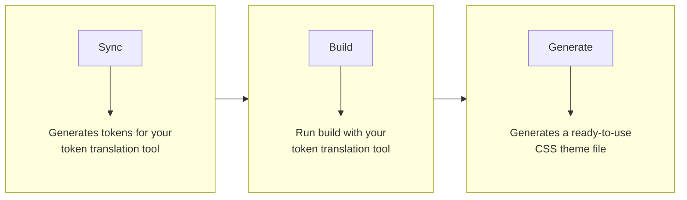

Theemo will **integrate** into your existing **toolchain** by **connecting**
multiple parts together. It will perform the following steps:

You can use one or all of the provided features, whatever fits for your situation.

Theemo provides all the infrastructure yet it never
understands your tokens at all. That is given the high diversity of design
tokens, they come in many forms and your `theemo.js` config acts as DSL to make
them understandable _to you_.

-> [Let's get you started](getting-started.md)
