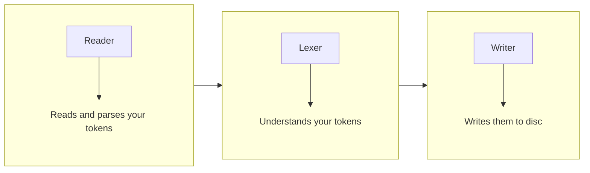

Sync tokens from your [design tool](https://www.designtokens.org/glossary/#design-tool) to your [token translation
tool](https://www.designtokens.org/glossary/#design-token-translation-tool).
This process is split into three steps:



- [Reader](reader.md) - Reads the tokens read from your design tool and parses
  them into a unified format
- [Lexer](lexer.md) - Understands the tokens your way
- [Writer](writer.md) - Writes them to disc according to your generated
  knowledge in the format of your preferred token translation tool

All instructions go into your `theemo.js` file under the `sync` key:

```js
module.exports = {
  sync: {...}
}
```

You can reach out for a full [example config](../example-config.md).
