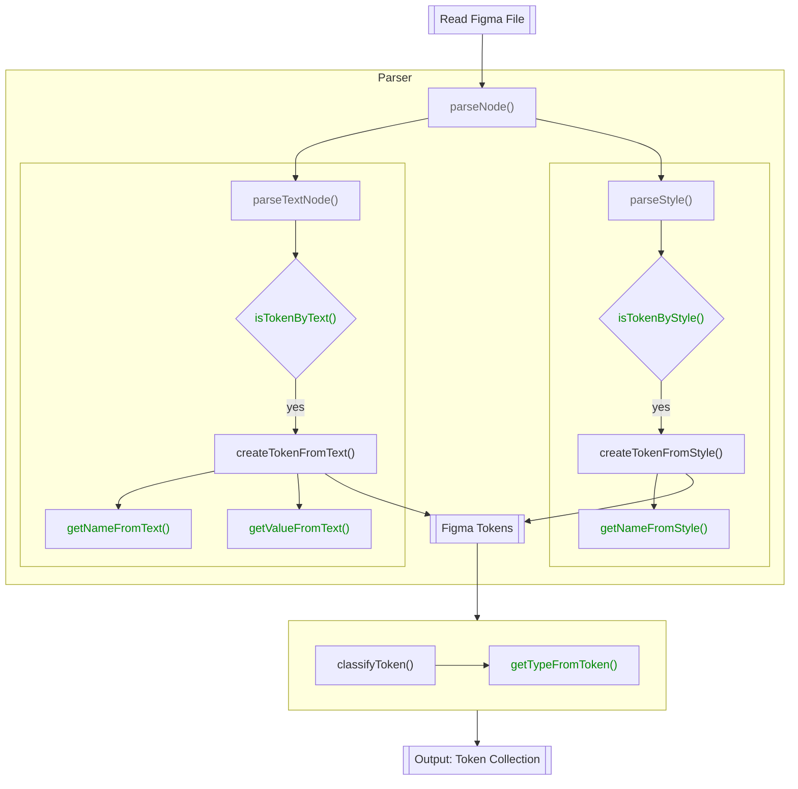

import useBaseUrl from '@docusaurus/useBaseUrl';

**Reads tokens from your design tool** and parses them into a unified format.
Connects to your `tool` (e.g. figma) and parses out tokens. Initial Config:

```js
{
  reader: {
    tool: 'figma';
  }
}
```

Depending on your source, you need to further merge in more properties.

## Figma

You are able to export tokens that are available in Figma itself, such as
colors, effects, texts and other named tokens, depending on your
organization. Let's go through each of those cases and how to configure
theemo to export them.

The flow for reading tokens from Figma is outlined here:



The green parts highlight the API at which you can customize this behavior to
your needs.

### Connecting to Figma

In order to read a Figma file, theemo needs credentials to request this data
from the public Figma Rest-API. Connecting to figma requires `figmaFile`
and `figmaSecret` parameters.

Figma doesn't natively support **references** (psst: you should not not abuse
descriptions for that). While theemo itself isn't forced to strictly use the
theemo plugin, it is the best option. For that you need `jsonbinFile` and
`jsonbinSecret` to [access references from theemo plugin](../../design/figma/sync)

Let's scaffold a `theemo.js` config that's using Figma as reader tool and theemo
as referening plugin:

```js
const { FIGMA_FILE, FIGMA_SECRET, JSONBIN_FILE, JSONBIN_SECRET } = process.env;

module.exports = {
  sync: {
    reader: {
      tool: 'figma',
      figmaFile: FIGMA_FILE,
      figmaSecret: FIGMA_SECRET,

      // referencer
      referencer: {
        type: 'figma-plugin',
        plugin: 'theemo',
        pluginConfig: {
          jsonbinFile: JSONBIN_FILE,
          jsonbinSecret: JSONBIN_SECRET,
          formats: {
            color: 'hex',
            colorAlpha: 'rgb',
          },
        },
      },
    },
  },
};
```

For credentials, create a `.env` file with these variables:

```sh
FIGMA_FILE=
FIGMA_SECRET=
JSONBIN_FILE=
JSONBIN_SECRET=
```

You'll find the secrets for both figma and jsonbin in their respective account
pages. For the `*_FILE` variables, you'll find them as:

- `FIGMA_FILE`: `https://www.figma.com/file/<file-id-is-here>/*`
- `JSONBIN_FILE`: `https://api.jsonbin.io/b/<file-id-is-here>`

### Styles

Styles are by far the most _natural_ implementation of design tokens in Figma.
Theemo reads _every_ style through the Figma API, that exists in your file.
Colors are likely to be the most interesting tokens to export from Figma.

:::note API Reference

- [`Style` Type on Figma API](https://www.figma.com/developers/api#style-type)

:::

#### `isTokenByStyle()`

Each style found in the Figma file is passed into that function and being asked,
whether this is a token or not.

The default implementation is, if the name of the token starts with a `.`, it
will respond `false`. That is the default behavior of Figma, where you can't
publish styles that begin with a `.` (as it is like a hidden folder on a unix
system).

#### `getNameFromStyle()`

To actually get the name of that style. By default, it will pass through the
name of the token as in figma, replacing `/` with `.`.

You might want to annotate token names, e.g. prefix with the `type` of the
style, such as:

```js
module.exports = {
  sync: {
    reader: {
      // ...

      getNameFromStyle(style) {
        let name = style.name.replaceAll('/', '.');

        if (style.styleType === 'FILL') {
          name = `color.${name}`;
        }

        return name;
      },
    },
  },
};
```

### Text Nodes

Theemo is not only able to extract tokens from styles, but also from text nodes
on the canvas itself. Let's assume we use a [modular
scale](https://www.modularscale.com/) system for our sizing, we only need `base`
and `ratio` parameters for this.

<figure>
  
  <figcaption>Sizing in Figma</figcaption>
</figure>

Figure 1 shows such a sizing configuration in Figma. Notice the `[token]` tags
as suffix for the node names. This will serve as indicators to recognize such
nodes as tokens in theemo.

:::note API Reference

- [`Text` Node on Figma API](https://www.figma.com/developers/api#text-props)

:::

#### `isTokenByText()`

By default no tokens are recognized, so we need to teach theemo to understand
text nodes who include the `[token]` tag:

```js
module.exports = {
  sync: {
    reader: {
      // ...

      isTokenByText(node) {
        return node.name.includes('[token]');
      },
    },
  },
};
```

#### `getNameFromText()`

Next up is to actually get the name from the node we let pass earlier. Here we
drop the `[token]` tag to get the _clean_ token name:

```js
module.exports = {
  sync: {
    reader: {
      // ...

      getNameFromText(node) {
        return node.name.replace('[token]', '').trim();
      },
    },
  },
};
```

#### `getValueFromText()`

So far theemo is handling a `node` which it knows it is a token and what the
name is. Finally we need to get the actual _value_ from the node. Theemo
provides a default implementation by returning the `characters` property from
the `node` (= the contents), which should already do it. However, you are free
to overwrite this behavior at this point.

### Tokens

Both `createTokenFromStyle()` and `createTokenFromText()` will create an
internal `FigmaToken`. Those `FigmaToken`s contain references to other tokens,
as per theemo plugin. At the end of the process, `FigmaToken`s will be compiled
into `Token`s and the result of the reader is to return an array of `Token`s
which will be put into the [lexer](./lexer).

:::note API References

- [`FigmaToken`](../../api/theemo.figmatoken)
- [`Token`](../../api/theemo.token)

:::

#### `getTypeFromToken()`

While handling the tokens from reading and parsing the source, theemo tries to
detect the _type_ of a token, based on the related Figma construct (ie. `Node`
or `Style`). You can provide your own customization to this:

```js
module.exports = {
  sync: {
    reader: {
      // ...

      getTypeFromToken: (token: FigmaToken) => {
        if (token.style) {
          return getTypefromStyle(token.style);
        }

        return '';
      };
    }
  }
}
```

### Output

Here are some samples from how the tokens are looking after they are read and
parsed from Figma:

```js
[
  // pair of contextual tokens
  {
    name: 'layout.background.$light',
    description: '',
    tier: 'unknown',
    type: 'color',
    colorScheme: undefined,
    reference: undefined,
    value: '#FFFFFF',
  },
  {
    name: 'layout.background.$dark',
    description: '',
    tier: 'unknown',
    type: 'color',
    colorScheme: undefined,
    reference: undefined,
    value: '#4D4D4D',
  },
  {
    name: 'layout.background',
    description: '',
    tier: 'unknown',
    type: 'color',
    colorScheme: undefined,
    reference: undefined,
    value: '#FFFFFF',
  },
  // regular token
  {
    name: 'intent.action.base.text',
    description: '',
    tier: 'unknown',
    type: 'color',
    colorScheme: undefined,
    reference: undefined,
    value: '#FFEC40',
  },
  // token with a reference
  {
    name: 'intent.action.active.text',
    description: '',
    tier: 'unknown',
    type: 'color',
    colorScheme: undefined,
    reference: 'intent.action.base.text',
    value: '#FFEC40',
  },
  // token with a reference and transform
  {
    name: 'intent.action.disabled.text',
    description: '',
    tier: 'unknown',
    type: 'color',
    colorScheme: undefined,
    reference: 'intent.action.base.text',
    value: 'rgba(255, 236, 64, 0.65)',
    transforms: { opacity: -35 },
  },
  // specific token
  {
    name: 'hero.text',
    description: '',
    tier: 'unknown',
    type: 'color',
    colorScheme: undefined,
    reference: 'text.normal',
    value: '#000000',
  },
  // text token
  {
    name: 'sizing.ratio',
    description: undefined,
    tier: 'unknown',
    type: 'content',
    colorScheme: undefined,
    reference: undefined,
    value: '1.3',
  },
  //...
];
```
